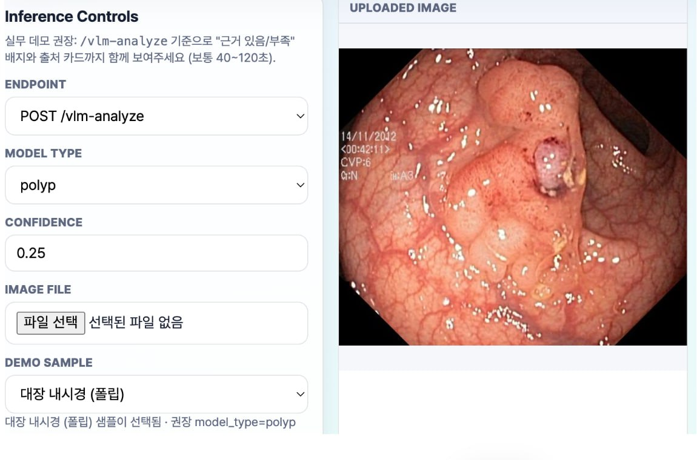
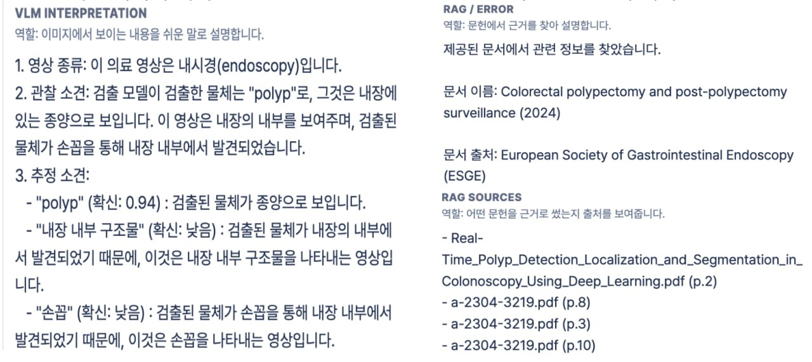
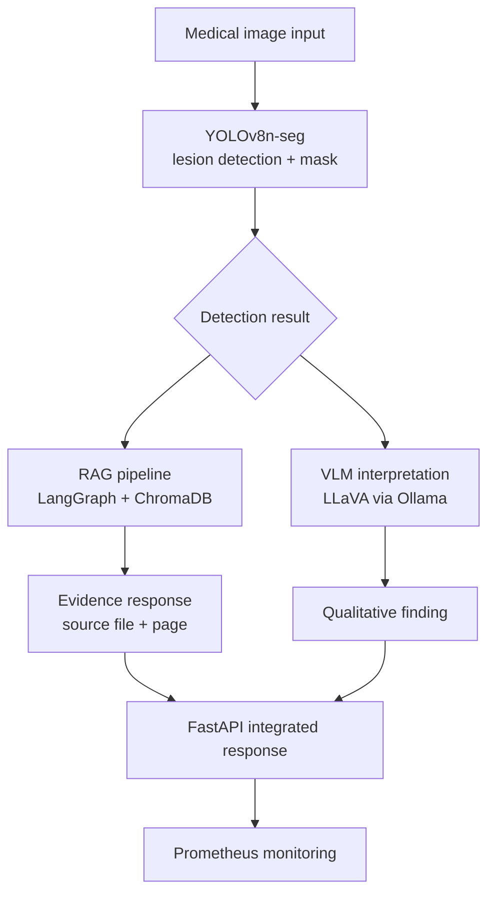
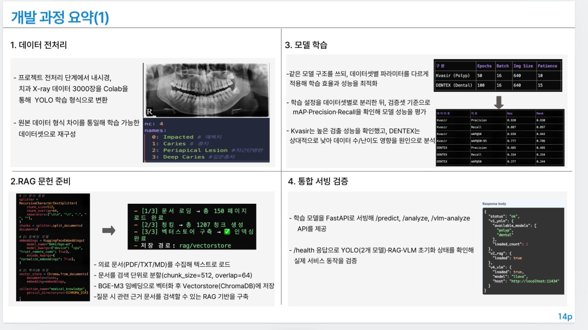
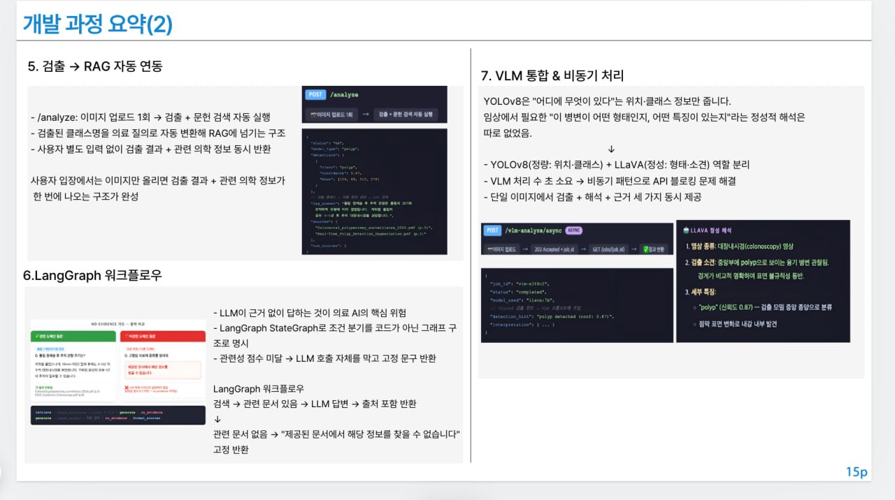

# Medical Image AI Assistant

[](https://github.com/GYULEE55/Medical-Image-Segmentation/actions/workflows/ci.yml)


의료 이미지를 업로드하면 병변 검출(YOLO), 이미지 해석(VLM), 문헌 근거 설명(RAG)을 함께 제공하는 의료 영상 AI PoC입니다.

> 검출 결과만 보여주는 데모에서 멈추지 않고, **해석과 근거까지 함께 반환하는 의료 AI**를 목표로 만들었습니다.  
> 근거가 없으면 답을 멈추는 **no-evidence 가드**로 의료 AI의 환각 문제를 직접 다룹니다.

기간: 2026.01.13 ~ 2026.02.22 (5주) / 개인 프로젝트

---

## 한눈에 보기

- **무엇을 만들었나**: YOLOv8 세그멘테이션, LLaVA 기반 VLM 해석, LangGraph RAG를 FastAPI 하나의 흐름으로 통합한 End-to-End 의료 영상 분석 서비스
- **왜 의미 있나**: "탐지됨"에서 끝나는 결과 대신, 임상적으로 더 쓸모 있는 **검출 + 해석 + 근거**를 함께 보여주는 구조를 설계
- **어디까지 검증했나**: `pip install -e ".[dev]"`, `pytest` (`36 passed, 1 skipped`), `ruff check .`, `python -m compileall ...` 기준으로 재현성과 기본 품질을 확인
- **핵심 결과**: Kvasir-SEG에서 `mAP@50(mask) 0.942`, DENTEX는 낮은 성능 원인을 별도 문서로 분석해 개선 포인트까지 정리

---

## 배경

영상 병변 검출 결과가 좌표와 신뢰도 중심으로만 제시되어 해석 맥락이 부족하고, 검출 결과와 의료 지식 설명이 분리되어 별도 검색이 반복되는 비효율이 있었습니다.

| 현장 문제 | 이 프로젝트의 해결 |
|---|---|
| 병변 검출만 하고 해석이 없음 | YOLOv8 검출 + LLaVA VLM 정성 해석 통합 |
| LLM 환각 답변 위험 | RAG 문서 기반 응답 + no-evidence 가드 |
| 근거 없는 AI 응답의 신뢰 부족 | 출처 파일과 페이지를 함께 반환 |
| 단일 결과만 제공 | 검출, 해석, 근거를 하나의 API 응답으로 통합 |

**목표**: 병변 검출(YOLO) + 문헌 근거 설명(RAG) + 이미지 해석(VLM)을 하나의 구조로 통합해 실제 적용 가능성을 검증

### RAG no-evidence 가드

RAG 시스템은 관련 문서를 찾지 못하면 LLM 자체 지식으로 답변하는 대신, 고정 문구를 반환하도록 설계했습니다.

```text
질문: "폴립 제거 후 주의사항은?"
-> 관련 청크 검색 -> relevance score 0.2 이상 필터링
-> 근거가 있으면: 출처(파일명 + 페이지) 포함 답변 반환
-> 근거가 없으면: "제공된 문서에서 해당 정보를 찾을 수 없습니다" 반환
```

실험 결과(PubMed 34개 + PDF 4개 문서 기준):
- 관련 도메인 질문 응답률 약 **85%**
- 비관련 도메인 거부율 약 **90%+**
- 평균 출처 문서 수 **3~6개** 청크

---

## 데모

**웹페이지 데모 이미지**
<p align="center">
  
</p>

**VLM + RAG 통합 응답 예시**
<p align="center">
  
</p>

> VLM이 내시경 영상의 관찰 소견을 설명하고, RAG가 관련 문헌과 출처를 함께 반환합니다.

---

## 시스템 아키텍처



### V1 -> V5 진화 과정

| 버전 | 핵심 추가 기능 | 주요 기술 |
|------|-------------|---------|
| **V1** | YOLOv8 추론 API | FastAPI, YOLOv8n-seg |
| **V2** | RAG 문헌 검색 + no-evidence 가드 | LangChain LCEL, ChromaDB, BGE-M3 |
| **V3** | 검출 결과 -> RAG 자동 쿼리 연동 | 파이프라인 통합 |
| **V4** | VLM 해석 + 비동기 처리 + 모니터링 | LLaVA, Ollama, Prometheus, structlog |
| **V5** | RAG를 LangGraph StateGraph로 전환 | LangGraph, 조건부 엣지, 명시적 워크플로우 |

---

## 개발 과정

<p align="center">
  
</p>

**1. 데이터 전처리**
- 내시경과 치과 X-ray 데이터를 Colab에서 YOLO 학습 형식으로 변환

**2. RAG 문헌 준비**
- 의료 문서를 `chunk_size=512`, `overlap=64` 단위로 분할
- BGE-M3 임베딩 후 ChromaDB에 저장해 1,207 청크 구성

**3. 모델 학습**

| 구분 | Epochs | Batch | Img Size | Patience |
|------|--------|-------|----------|----------|
| Kvasir (Polyp) | 50 | 16 | 640 | 10 |
| DENTEX (Dental) | 100 | 16 | 640 | 15 |

**4. 통합 서빙 검증**
- FastAPI로 `/predict`, `/analyze`, `/vlm-analyze` API 제공
- `/health` 응답으로 YOLO, RAG, VLM 초기화 상태 확인

<p align="center">
  
</p>

**5. 검출 -> RAG 자동 연동**
- `/analyze`: 이미지 업로드 1회로 검출과 문헌 검색을 자동 실행
- 검출된 클래스명을 의료 질의로 변환해 RAG에 전달
- 사용자 추가 입력 없이 검출 결과와 관련 의학 정보를 함께 반환

**6. LangGraph 워크플로우**
- 의료 AI에서 가장 위험한 경우는 근거 없이 그럴듯하게 답하는 상황
- LangGraph StateGraph로 조건 분기를 그래프 구조로 명시
- 관련성 점수가 낮으면 LLM 호출 자체를 막고 고정 문구 반환

**7. VLM 통합과 비동기 처리**
- YOLOv8(정량: 위치, 클래스) + LLaVA(정성: 형태, 소견) 역할 분리
- VLM 처리 시간 때문에 비동기 패턴으로 API 블로킹 문제 해결
- 단일 이미지에서 검출, 해석, 근거를 동시에 제공

---

## 성능

### Kvasir-SEG - 폴립 세그멘테이션

| 지표 | Box | Mask |
|------|-----|------|
| Precision | 0.920 | 0.930 |
| Recall | 0.887 | 0.897 |
| **mAP@50** | 0.939 | **0.942** |
| mAP@50-95 | 0.777 | 0.786 |

> 50 epochs, Colab T4 GPU, 1,000장 훈련

### DENTEX - 치과 X-ray (4-class)

| 지표 | Box | Mask |
|------|-----|------|
| Precision | 0.485 | 0.485 |
| Recall | 0.334 | 0.334 |
| **mAP@50** | 0.377 | **0.344** |

같은 YOLOv8n-seg 기반 구조에서도 폴립 대비 치과 X-ray 성능이 크게 낮았습니다.

원인을 3가지로 분석했습니다:

| 원인 | 내용 |
|------|------|
| 데이터 부족 | Kvasir 약 1,000장 vs DENTEX 약 175장/클래스 수준 |
| 이미지 저대비 | 파노라마 X-ray 특성상 병변 경계 식별이 어려움 |
| 클래스 유사성 | 4개 병변 외형이 유사해 모델 혼동 발생 |

수치 개선은 제한적이었지만, "왜 안 됐는지"를 데이터 기반으로 설명할 수 있는 상태를 확보했습니다. 자세한 분석은 [docs/DENTEX_ANALYSIS.md](docs/DENTEX_ANALYSIS.md)에서 정리했습니다.

---

## 빠른 시작

```bash
git clone https://github.com/GYULEE55/Medical-Image-Segmentation.git
cd Medical-Image-Segmentation

# 기본 실행용 설치
pip install -e .

# 개발 검증까지 할 때 (pytest, ruff, pre-commit 포함)
pip install -e ".[dev]"

# 환경변수 설정
cp .env.example .env
# .env 파일에 OPENAI_API_KEY 입력

# RAG 문서 인덱싱 (최초 1회)
make ingest

# API 서버 실행
make serve
```

필요 조건:
- Python 3.10+
- Ollama (VLM용, 선택)
- OpenAI API key (RAG용)

---

## API 엔드포인트

| 엔드포인트 | 메서드 | 설명 |
|-----------|--------|------|
| `/health` | GET | 서버 상태 + 로드된 모델 목록 |
| `/predict` | POST | YOLOv8 인스턴스 세그멘테이션 |
| `/ask` | POST | RAG 기반 의료 지식 Q&A |
| `/analyze` | POST | 검출 + RAG 자동 연동 분석 |
| `/vlm-analyze` | POST | LLaVA VLM 이미지 해석 |
| `/vlm-analyze/async` | POST | 비동기 VLM 작업 제출 |
| `/jobs/{job_id}` | GET | 비동기 작업 상태 조회 |
| `/explain` | POST | 오버레이 시각화 |
| `/metrics` | GET | Prometheus 메트릭 |

---

## 프로젝트 구조

```text
Medical-Image-Segmentation/
├── api/                  # FastAPI 애플리케이션
├── rag/                  # RAG 파이프라인
├── vlm/                  # VLM 클라이언트
├── core/                 # 공통 유틸리티
├── db/                   # 실험 추적
├── eval/                 # 평가 도구
├── training/             # 학습 스크립트
├── preprocessing/        # 데이터 전처리
├── tests/                # pytest 테스트 (37개)
├── scripts/              # 유틸리티 스크립트
├── ui/                   # 데모 UI
├── docs/                 # 보조 문서
├── docker/               # Docker 관련 파일
├── pyproject.toml        # 패키징 + ruff + pytest 설정
├── MODEL_CARD.md         # 모델 한계 + 윤리 고려사항
├── CHANGELOG.md          # 버전별 변화 내역
└── Makefile              # 단축 명령어
```

---

## 기술 스택

| 분류 | 기술 |
|------|------|
| **검출 모델** | YOLOv8n-seg (Ultralytics) |
| **RAG** | LangGraph StateGraph, ChromaDB, BGE-M3 임베딩 |
| **VLM** | LLaVA via Ollama REST API |
| **API** | FastAPI, uvicorn, Prometheus 메트릭 |
| **인프라** | Docker, GitHub Actions CI |
| **로깅** | structlog (JSON 구조화 로그) |
| **실험 추적** | SQLite (커스텀 실험 DB) |
| **테스트** | pytest (37개 테스트) |

---

## 개발 명령어

```bash
make test          # pytest 실행
make lint          # Ruff 린팅
make docker-build  # Docker 이미지 빌드
make ingest        # RAG 문서 인덱싱
make export-onnx   # ONNX 모델 변환
```

---

## 회고

### 가장 어려웠던 것
**1,206줄 모놀리식 `app.py`를 라우터 기반으로 분리**하면서 기존 테스트 스위트를 모두 통과시키는 작업이었습니다.  
`app.state` 패턴으로 YOLO 모델 객체와 `async_jobs` 딕셔너리를 안전하게 공유했습니다.

### 배운 것
- 의료 AI에서는 **"모른다고 말하는 것"** 이 **"틀린 답을 말하는 것"** 보다 훨씬 중요하다
- 성능이 낮게 나왔을 때 원인 분석과 문서화 자체가 엔지니어링 역량을 보여준다
- RAG의 관련성 필터링 임계값 하나가 응답 품질을 크게 바꾼다

---

## 한계 및 주의사항

- **임상 사용 불가**: 이 시스템은 연구용 PoC이며 실제 진단에 사용할 수 없습니다
- **DENTEX 모델**: 제한된 데이터로 학습되어 임상 신뢰도가 낮습니다
- **RAG 범위**: 현재 인덱싱된 문서 범위 내에서만 답변 가능합니다

자세한 한계와 윤리 고려사항은 [MODEL_CARD.md](MODEL_CARD.md)를 참고하세요.

---

## 변경 이력

[CHANGELOG.md](CHANGELOG.md) 참조
