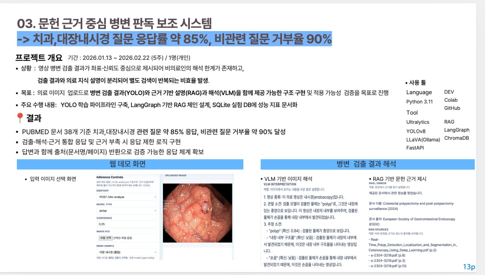

# Medical Image AI Assistant

의료 이미지를 업로드하면 병변 검출(YOLO), 문헌 근거 설명(RAG), 이미지 해석(VLM)을 함께 제공하는 보조 진단 파이프라인입니다.

기간: 2026.01.13 ~ 2026.02.22 (5주) / 개인 프로젝트

---

## 배경

영상 병변 검출 결과가 좌표·신뢰도 중심으로만 제시되어 의료인의 해석 한계가 존재하고, 검출 결과와 의료 지식 설명이 분리되어 별도 검색이 반복되는 비효율이 있었습니다.

**목표**: 병변 검출(YOLO) + 문헌 근거 설명(RAG) + 이미지 해석(VLM)을 하나의 구조로 통합해 실제 적용 가능성 검증

---

## 결과

- PubMed 문서 38개 기준 치과·대장내시경 관련 질문 약 **85% 응답**, 비관련 질문 거부율 약 **90%**
- 검출·해석·근거 통합 응답 및 근거 부족 시 응답 제한 로직 구현
- 답변과 함께 출처(문서명/페이지) 반환으로 검증 가능한 응답 체계 확보

---

## 데모

<p align="center">
  
</p>

**VLM + RAG 통합 응답 예시**

<p align="center">
  
</p>

> VLM이 내시경 영상의 관찰 소견을 설명하고, RAG가 관련 문헌과 출처를 함께 반환합니다.

---

## 개발 과정

<p align="center">
  
</p>

**1. 데이터 전처리**
- 내시경·치과 X-ray 데이터 3,000장을 Colab에서 YOLO 학습 형식으로 변환
- 원본 데이터 형식 차이를 통일해 학습 가능한 데이터셋으로 재구성

**2. RAG 문헌 준비**
- 의료 문서(PDF/TXT/MD)를 수집해 텍스트로 로드
- chunk_size=512, overlap=64 단위로 분할
- BGE-M3 임베딩 후 ChromaDB(Vectorstore)에 저장
- 결과: 1,207 청크, 벡터스토어 인덱싱 완료

**3. 모델 학습**
- 같은 모델 구조로 데이터셋별 파라미터를 분리해 학습

| 구분 | Epochs | Batch | Img Size | Patience |
|------|--------|-------|----------|----------|
| Kvasir (Polyp) | 50 | 16 | 640 | 10 |
| DENTEX (Dental) | 100 | 16 | 640 | 15 |

**4. 통합 서빙 검증**
- FastAPI로 `/predict`, `/analyze`, `/vlm-analyze` API 제공
- `/health` 응답으로 YOLO(2개 모델)·RAG·VLM 초기화 상태 확인해 실제 서비스 동작 검증

---

## 성능

**Kvasir-SEG — 폴립 세그멘테이션**

| Precision | Recall | mAP@50 (Mask) |
|-----------|--------|---------------|
| 0.920 | 0.887 | **0.942** |

**DENTEX — 치과 X-ray (4-class)**

| mAP@50 (Mask) |
|---------------|
| 0.344 |

DENTEX 성능이 낮은 이유는 클래스당 ~175장 데이터 부족, 파노라마 X-ray 저대비, 4-class 시각적 유사성 문제입니다.
원인 분석 → [docs/DENTEX_ANALYSIS.md](docs/DENTEX_ANALYSIS.md)

---

## 구조

```
api/
  routers/     # predict / ask / analyze / vlm / monitoring
rag/
  chain.py     # LangGraph StateGraph + no-evidence 가드
  ingest.py    # PDF → ChromaDB 인덱싱
  docs/        # PubMed 논문 38개 + PDF 4개
vlm/
  client.py    # LLaVA via Ollama REST API (비동기)
training/      # 학습 스크립트 (로컬 + Colab)
preprocessing/ # Kvasir-SEG, DENTEX → YOLO 포맷 변환
tests/         # pytest 36개
```

---

## 실행

```bash
git clone https://github.com/GYULEE55/Medical-Image-Segmentation.git
cd Medical-Image-Segmentation
pip install -e .
cp .env.example .env
make ingest    # RAG 문서 인덱싱 (최초 1회)
make serve     # API 서버 실행
```

---

## 기술 스택

- YOLOv8n-seg (Ultralytics), PyTorch, OpenCV
- LLaVA via Ollama (VLM)
- LangGraph, ChromaDB (RAG)
- FastAPI, uvicorn
- SQLite (실험 추적)

---

> 연구용 PoC입니다. 실제 임상 진단에 사용할 수 없습니다.
