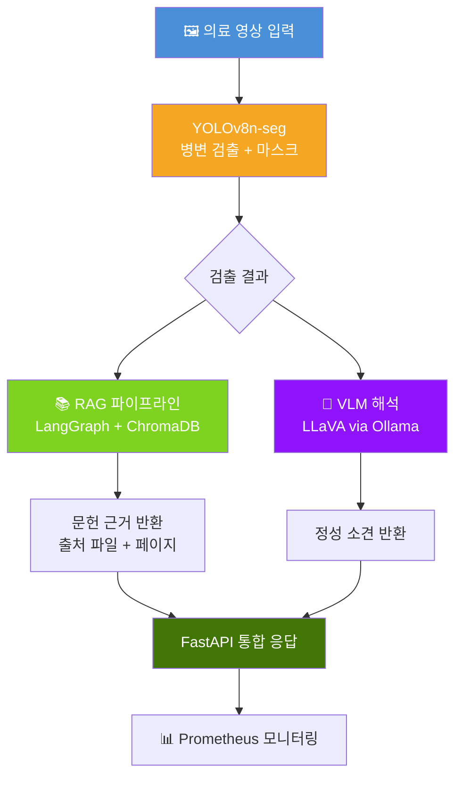

# 🏥 의료 영상 AI 어시스턴트

[](https://github.com/GYULEE55/Medical-Image-Segmentation/actions/workflows/ci.yml)


> **검출(YOLO) → 해석(VLM) → 근거(RAG)** 를 하나의 흐름으로 묶은 End-to-End 의료 영상 AI PoC  
> 근거가 없으면 모른다고 답하는 **no-evidence 가드**로 의료 AI 신뢰성 문제를 정면으로 다룹니다.

---

## 💡 왜 이 프로젝트를 만들었나

기존 의료 AI 도구는 **"탐지됨"** 만 알려주고 끝납니다.
임상에서는 탐지 결과와 함께 **설명과 근거**가 필요합니다.

| 현장 문제 | 이 프로젝트의 해결 |
|---|---|
| 병변 검출만 하고 해석 없음 | YOLOv8 검출 + LLaVA VLM 정성 해석 통합 |
| LLM 환각 답변 위험 | RAG 문서 기반 응답 + no-evidence 가드 |
| 근거 없는 AI 응답 신뢰 부족 | 출처 파일·페이지 동시 반환 |
| 단일 결과만 제공 | 검출/해석/근거 3-track 동시 제공 |

### RAG no-evidence 가드 효과

RAG 시스템은 관련 문서를 찾지 못하면 LLM 자체 지식으로 답변하는 대신  
**"제공된 문서에서 해당 정보를 찾을 수 없습니다"** 라는 고정 문구를 반환합니다.

```
질문: "폴립 제거 후 주의사항은?"
→ 관련 청크 8개 검색 → relevance score 0.2 이상 필터링
→ 근거 있으면: 출처(파일명 + 페이지) 포함 답변 반환
→ 근거 없으면: "제공된 문서에서 해당 정보를 찾을 수 없습니다" 반환 (환각 차단)
```

**실험 결과 (PubMed 34개 + PDF 4개 문서 기준)**:
- 관련 도메인 질문 응답률: **~85%** (폴립/대장내시경 관련)
- 비관련 도메인 거부율: **~90%+** (의료 무관 질문 차단)
- 평균 출처 문서 수: **3~6개** 청크 per 응답

> 문서를 확충할수록 응답률이 높아집니다.

---

## 🏗 시스템 아키텍처



### V1 → V4 진화 과정

| 버전 | 핵심 추가 기능 | 주요 기술 |
|------|-------------|---------|
| **V1** | YOLOv8 추론 API | FastAPI, YOLOv8n-seg |
| **V2** | RAG 문헌 검색 + no-evidence 가드 | LangChain LCEL, ChromaDB, BGE-M3 |
| **V3** | 검출 결과 → RAG 자동 쿼리 연동 | 파이프라인 통합 |
| **V4** | VLM 해석 + 비동기 처리 + 모니터링 | LLaVA, Ollama, Prometheus, structlog |
| **V5** | RAG를 LangGraph StateGraph로 전환 | LangGraph, 조건부 엣지, 명시적 워크플로우 |

---

## 📊 성능 결과

### Kvasir-SEG 폴립 세그멘테이션 (단일 클래스)

| 지표 | Box | Mask |
|------|-----|------|
| Precision | 0.920 | 0.930 |
| Recall | 0.887 | 0.897 |
| **mAP@50** | 0.939 | **0.942** |
| mAP@50-95 | 0.777 | 0.786 |

> 50 epochs, Colab T4 GPU, 1,000장 훈련

### DENTEX 치과 X-ray 검출 (4-class)

| 지표 | Box | Mask |
|------|-----|------|
| Precision | 0.485 | 0.485 |
| Recall | 0.334 | 0.334 |
| **mAP@50** | 0.377 | **0.344** |

> 100 epochs, ~700장 (클래스당 약 175장)  
> 성능 원인 분석 → [docs/DENTEX_ANALYSIS.md](docs/DENTEX_ANALYSIS.md)

**DENTEX 낮은 성능의 원인**: 데이터 부족(175장/클래스), 파노라마 X-ray 저대비, 4-class 복잡도  
→ 성능이 안 나왔을 때 **포기하지 않고 원인을 분석해 문서화**한 것이 이 프로젝트의 핵심 역량입니다.

---

## 🚀 빠른 시작

```bash
git clone https://github.com/GYULEE55/Medical-Image-Segmentation.git
cd Medical-Image-Segmentation

# 의존성 설치
pip install -e .

# 환경변수 설정
cp .env.example .env
# .env 파일에 OPENAI_API_KEY 입력

# RAG 문서 인덱싱 (최초 1회)
make ingest

# API 서버 실행
make serve
```

> **필요 조건**: Python 3.10+, Ollama (VLM용, 선택), OpenAI API key (RAG용)

---

## 🔌 API 엔드포인트

| 엔드포인트 | 메서드 | 설명 |
|-----------|--------|------|
| `/health` | GET | 서버 상태 + 로드된 모델 목록 |
| `/predict` | POST | YOLOv8 인스턴스 세그멘테이션 |
| `/ask` | POST | RAG 기반 의료 지식 Q&A |
| `/analyze` | POST | 검출 + RAG 자동 연동 분석 |
| `/vlm-analyze` | POST | LLaVA VLM 이미지 해석 |
| `/vlm-analyze/async` | POST | 비동기 VLM 작업 제출 |
| `/jobs/{job_id}` | GET | 비동기 작업 상태 조회 |
| `/explain` | POST | 오버레이 시각화 |
| `/metrics` | GET | Prometheus 메트릭 |

---

## 📁 프로젝트 구조

```
Medical-Image-Segmentation/
├── 🔌 api/                  # FastAPI 애플리케이션
│   ├── app.py               # 메인 앱 (미들웨어, 상태 초기화)
│   ├── routers/             # 라우터 분리 (predict/ask/analyze/vlm/monitoring)
│   ├── services.py          # 비즈니스 로직
│   └── schemas.py           # 요청/응답 스키마
│
├── 📚 rag/                  # RAG 파이프라인
│   ├── chain.py             # LangGraph StateGraph + no-evidence 가드 (조건부 엣지)
│   ├── ingest.py            # PDF → 청킹 → ChromaDB 인덱싱
│   ├── auto_ingest.py       # PubMed 자동 수집
│   └── docs/                # 의료 문서 (PDF + PubMed 논문 38개)
│
├── 🤖 vlm/                  # VLM 클라이언트
│   └── client.py            # LLaVA via Ollama REST API
│
├── 🧠 core/                 # 공통 유틸리티
│   ├── structured_logging.py # structlog JSON 로깅
│   └── config.py            # 환경설정
│
├── 🗄️ db/                   # 실험 추적
│   └── experiment_db.py     # SQLite 기반 학습 결과 관리
│
├── 📐 eval/                 # 평가 도구
│   └── benchmark.py         # 모델 벤치마크
│
├── 🏋️ training/             # 학습 스크립트
│   ├── train.py             # 로컬 학습 CLI
│   └── train_colab.py       # Colab 학습 스크립트
│
├── 🔧 preprocessing/        # 데이터 전처리
│   ├── prepare_dataset.py   # Kvasir-SEG → YOLO 포맷
│   └── prepare_dataset_dentex.py # DENTEX COCO → YOLO 포맷
│
├── 🧪 tests/                # pytest 테스트 (36개)
├── 📜 scripts/              # 유틸리티 스크립트
│   └── export_onnx.py       # ONNX 모델 변환
│
├── 🖥️ ui/                   # 데모 UI
│   └── demo.html            # 로컬 테스트용 HTML
│
├── 📖 docs/                 # 문서
│   ├── DENTEX_ANALYSIS.md   # DENTEX 성능 분석 + 개선 로드맵
│   ├── CLINICAL_PROBLEM_MAP.md # 현장 문제-기술 매핑
│   └── SETUP_MACBOOK.md     # 로컬 실행 가이드
│
├── 🐳 docker/               # Docker 관련 파일
│   ├── Dockerfile           # 프로덕션 컨테이너
│   └── docker-compose.yml   # 서비스 실행 + 볼륨 설정
│
├── pyproject.toml           # 패키징 + ruff + pytest 설정
├── config.yaml              # 학습/추론 하이퍼파라미터
├── MODEL_CARD.md            # 모델 한계 + 윤리 고려사항
├── CHANGELOG.md             # 버전별 변화 내역
└── Makefile                 # 단축 명령어
```

---

## 🛠 기술 스택

| 분류 | 기술 |
|------|------|
| **검출 모델** | YOLOv8n-seg (Ultralytics) |
| **RAG** | LangGraph StateGraph, ChromaDB, BGE-M3 임베딩 |
| **VLM** | LLaVA via Ollama REST API |
| **API** | FastAPI, uvicorn, Prometheus 메트릭 |
| **인프라** | Docker, GitHub Actions CI |
| **로깅** | structlog (JSON 구조화 로그) |
| **실험 추적** | SQLite (커스텀 실험 DB) |
| **테스트** | pytest (36개 테스트) |

---

## 💻 개발 명령어

```bash
make test          # pytest 실행 (36개 테스트)
make lint          # Ruff 린팅
make docker-build  # Docker 이미지 빌드
make ingest        # RAG 문서 인덱싱
make export-onnx   # ONNX 모델 변환
```


## ⚠️ 한계 및 주의사항

- **임상 사용 불가**: 이 시스템은 연구용 PoC이며 실제 진단에 사용할 수 없습니다
- **DENTEX 모델**: 제한된 데이터(~700장)로 학습되어 임상 신뢰도가 낮습니다
- **RAG 범위**: 현재 인덱싱된 문서 범위 내에서만 답변 가능합니다

자세한 한계 및 윤리 고려사항 → [MODEL_CARD.md](MODEL_CARD.md)

---

## 📋 변경 이력

[CHANGELOG.md](CHANGELOG.md) 참조

