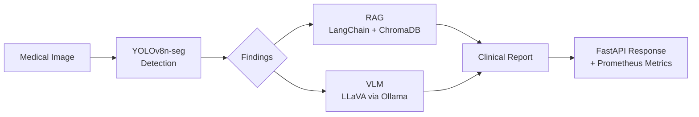

# Medical Image Segmentation AI

[](https://github.com/your-username/Medical-Image-Segmentation/actions/workflows/ci.yml)


End-to-end medical AI system: **YOLOv8 Instance Segmentation → RAG Evidence Retrieval → VLM Interpretation**

---

## Architecture



**V1→V4 Architecture Evolution:**

| Version | Feature | Tech |
|---------|---------|------|
| V1 | YOLOv8 Detection API | FastAPI, YOLOv8n-seg |
| V2 | RAG Evidence Retrieval | LangChain, ChromaDB, BGE-M3 |
| V3 | VLM Integration | LLaVA, Ollama |
| V4 | Async Jobs + Monitoring | Prometheus, structlog, SQLite |

---

## Quick Start

```bash
git clone https://github.com/your-username/Medical-Image-Segmentation.git
cd Medical-Image-Segmentation
pip install -e .
uvicorn api.app:app --reload
```

> Requires: Python 3.10+, Ollama (for VLM), OpenAI API key (for RAG). Copy `.env.example` to `.env` and fill in your keys.

---

## API Endpoints

| Endpoint | Method | Description |
|----------|--------|-------------|
| `/health` | GET | Server status + loaded models |
| `/predict` | POST | YOLOv8 instance segmentation |
| `/ask` | POST | RAG-based medical Q&A |
| `/analyze` | POST | Vision + LLM integrated analysis |
| `/vlm-analyze` | POST | VLM interpretation (LLaVA) |
| `/vlm-analyze/async` | POST | Async VLM job submission |
| `/jobs/{job_id}` | GET | Async job status |
| `/explain` | POST | Overlay visualization |
| `/metrics` | GET | Prometheus metrics |

---

## Results

| Dataset | Task | mAP@50 | Precision | Recall | Images | Epochs |
|---------|------|--------|-----------|--------|--------|--------|
| Kvasir-SEG | Polyp Segmentation | **0.942** | 0.930 | 0.897 | 1,000 | 50 |
| DENTEX | Dental X-ray (4-class) | 0.344 | 0.485 | 0.334 | 700 | 100 |

> DENTEX covers 4 classes (Caries, Deep Caries, Periapical Lesion, Impacted) on limited data.
> See [docs/DENTEX_ANALYSIS.md](docs/DENTEX_ANALYSIS.md) for detailed analysis and improvement roadmap.

---

## Tech Stack

| Category | Technology |
|----------|-----------|
| Detection | YOLOv8n-seg (Ultralytics) |
| RAG | LangChain LCEL, ChromaDB, BGE-M3 embeddings |
| VLM | LLaVA via Ollama REST API |
| API | FastAPI, uvicorn, Prometheus metrics |
| Infra | Docker, GitHub Actions CI |
| Logging | structlog (JSON structured logs) |
| Experiment Tracking | SQLite (custom experiment DB) |

---

## Project Structure

```
├── api/              # FastAPI application (routers, middleware)
├── rag/              # RAG pipeline (LangChain + ChromaDB)
├── vlm/              # VLM client (LLaVA via Ollama)
├── core/             # Structured logging utilities
├── db/               # Experiment tracking (SQLite)
├── eval/             # Benchmark scripts
├── training/         # Training scripts (Colab-ready)
├── preprocessing/    # Dataset preparation (Kvasir-SEG, DENTEX)
├── tests/            # pytest suite (36 tests)
├── scripts/          # Utility scripts (ONNX export)
├── docs/             # Documentation
├── Dockerfile        # Production container (Python 3.10-slim)
├── docker-compose.yml
├── pyproject.toml    # Standard Python packaging
└── Makefile          # Common commands
```

---

## Development

```bash
make test          # Run pytest (36 tests)
make lint          # Ruff linting
make docker-build  # Build Docker image
make ingest        # Index RAG documents
make export-onnx   # Export model to ONNX
```

**Run with Docker:**
```bash
docker-compose up
```

---

## Model Card

See [MODEL_CARD.md](MODEL_CARD.md) for detailed model information, limitations, and ethical considerations.
